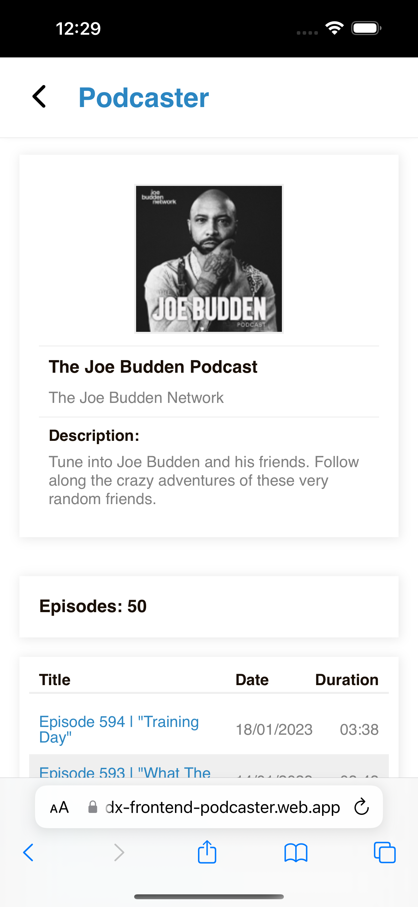

# Inditext - Podcaster

<p align="left">
  
  
</p>

## Demo

You can try it [here](https://indx-frontend-podcaster.web.app/).

## Requirements
See requirements in [doc](./doc/prueba-tecnica-front-end-zaracom_podcasts.pdf).

This project was bootstrapped with [Create React App](https://github.com/facebook/create-react-app).

## Used libraries

- React
- React Query
- React Router
- Styled Components
- Linkify
- Polished
- Signals-react

## Installation

 - Use the package manager [npm](https://www.npmjs.com/get-npm) in the folder of the project to install dependencies.
 - Node.js 16 or later

```bash
npm install
```
### CORS PROXY
- For cors proxy i used [corsproxy.io](https://corsproxy.io).
## Available Scripts

In the project directory, you can run:

### Development mode
```bash
npm start
```
### Build webapp for production
```bash
npm build
```
## Proyect structure
- **api**: contains function for fetch data
- **assets**: contains only images
- **components**: React components
- **constants**: Include constants for re-use in proyect
- **hooks**: contains Custom Hooks for connect data service and filters.
- **layouts**: Layouts for wrap pages.
- **pages**: render pages for each route.
- **state**: Basic state for aplication.
- **styles**: Provider of styles for all aplication.
- **utils**: functions for formatter date or destructuring data.

## TODOs

- Automatic Testing with Jest and React testing library in react components.
- Create a loading skeleton.
